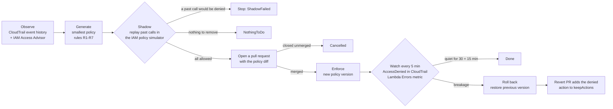
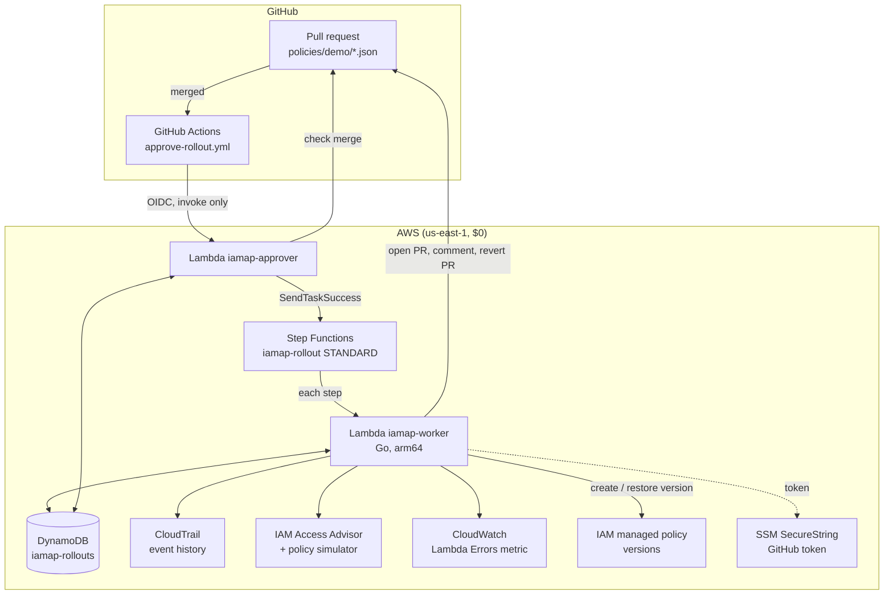

# IAM Least-Privilege Autopilot

[](https://github.com/singha105/iam-autopilot/actions/workflows/ci.yml)


[](LICENSE)

**Tightens over-broad AWS IAM policies automatically, and rolls itself back if it breaks something.**

## The problem

Most IAM roles keep permissions nobody uses: `s3:*` where the code only lists buckets,
`dynamodb:*` where it reads one table. Everyone knows these should shrink. Nobody does it,
because removing the one permission a rare job needs breaks production, and nobody knows
which one that is.

## Results

Every number below is computed from the rollout records by `autopilot report`; the full
table is in [docs/results.md](docs/results.md).

<!-- results:start -->
| | |
|---|---|
| Roles tightened | 3 |
| Permissions granted before → after (latest enforced rollout per role) | 2110 → 11 |
| Permissions removed | 2099 (99.5%) |
| Automatic rollbacks | 1 |
| Median time to detect (enforcement → first watch that saw the breakage) | 300 s (5.0 min) |
| Median time to roll back (detection → previous version restored) | 0.9 s |
| Breaking changes left in place | 0 |
| Rollout records | 8 |
<!-- results:end -->

## How a rollout works

One rollout tightens one role's policy. It is an AWS Step Functions workflow; a person
approves by merging a pull request.



1. **Observe.** CloudTrail event history gives every management call the role made, with
   its resources. IAM Access Advisor shows which services it used at all, including
   data-plane calls that event history never records.
2. **Generate.** Rules R1-R7 keep observed actions on the resources they touched, keep
   data-plane actions only with evidence, honour a keep-list, and never grant more than
   today's policy.
3. **Shadow.** Every past call is replayed against the proposal in the IAM policy
   simulator. A call that would now be denied stops the rollout before anything changes.
4. **Approve.** The proposal is a pull request: a diff of the policy file, a per-service
   table, and what happens on merge. Merging is the approval.
5. **Enforce, watch, roll back.** The policy becomes a new version. For 45 minutes the
   autopilot watches for denials. On the first one it restores the previous version in
   about a second and opens a revert PR, so the next proposal keeps the action.

A normal rollout is 35 Step Functions state transitions; the free tier covers 4,000 a month.

## Architecture



The worker and the approver are one Go binary deployed twice with different IAM roles.
GitHub holds no AWS keys: the workflow assumes a role through OIDC that can only invoke
the approver, and the approver re-checks the merge with GitHub before resuming anything.

## Three scenarios, run for real

| Scenario | Role | Pull requests | What it proved |
|---|---|---|---|
| **A. Big reduction** | inventory | [#2](https://github.com/singha105/iam-autopilot/pull/2) | 1273 → 5 permissions applied and watched with live traffic; nothing broke. |
| **B. Blind spot** | config-reader | [#3](https://github.com/singha105/iam-autopilot/pull/3) | `dynamodb:GetItem`/`PutItem` never appear in event history. They were kept as *kept-unobservable*, scoped to the one table, and the app kept reading and writing during the watch. |
| **C. Rollback and learning** | quarterly | [#4](https://github.com/singha105/iam-autopilot/pull/4) → [#5](https://github.com/singha105/iam-autopilot/pull/5) → [#6](https://github.com/singha105/iam-autopilot/pull/6) | The proposal removed `ssm:GetParametersByPath`, used only by a quarter-end job. The job ran during the watch and was denied; the autopilot restored the old version in under a second and opened revert PR #5 adding the action to `keepActions`. The next proposal (#6) kept it (rules R2 and R6: seen in use, and on the keep-list) and the job succeeded during its watch. |

## Design decisions

Each has a short record in [DECISIONS.md](DECISIONS.md).

- [ADR-001](DECISIONS.md#adr-001-standard-library-flag-package-for-the-cli): standard library `flag` for the CLI, not cobra.
- [ADR-002](DECISIONS.md#adr-002-exclude-platform-calls-from-observed-usage): calls AWS makes with the role's credentials are not usage.
- [ADR-003](DECISIONS.md#adr-003-keep-data-plane-actions-only-with-evidence-rule-r4): keep unobservable data-plane actions only with evidence.
- [ADR-004](DECISIONS.md#adr-004-iam-policy-simulator-for-shadow-mode-not-access-analyzer-custom-checks): the free policy simulator for shadow mode; only regressions fail.
- [ADR-005](DECISIONS.md#adr-005-a-merged-pr-is-the-approval-the-github-token-lives-in-ssm-securestring): a merged PR is the approval; the token is an SSM SecureString.
- [ADR-006](DECISIONS.md#adr-006-one-managed-policy-per-role-changed-through-policy-versions): one managed policy per role, changed through versions; rollback is one call.
- [ADR-007](DECISIONS.md#adr-007-github-actions-approves-through-oidc-scoped-to-this-repos-pull_request-events): GitHub approves through OIDC, scoped to this repository.
- [ADR-008](DECISIONS.md#adr-008-two-breakage-signals-cloudtrail-accessdenied-and-the-lambda-errors-metric): two breakage signals, CloudTrail and the Lambda Errors metric.
- [ADR-009](DECISIONS.md#adr-009-event-history-instead-of-a-trail-and-athena): event history instead of a trail and Athena, and the scale-up path.
- [ADR-010](DECISIONS.md#adr-010-permissions-boundary-on-the-demo-roles): a permissions boundary makes the demo safe in a real account.

## Cost: runs for $0

<!-- Add a screenshot of the AWS Billing page showing $0.00 here, e.g. docs/billing.png -->
*Billing screenshot: to be added.*

**Used, all free or far inside the always-free allowances:** CloudTrail event history,
IAM Access Advisor, the IAM policy simulator, Access Analyzer `ValidatePolicy`, Lambda (Go,
arm64, 128-256 MB, no VPC), Step Functions STANDARD (no logging), DynamoDB provisioned at
1 read and 1 write unit, SSM Parameter Store standard tier with the default key,
CloudWatch `GetMetricStatistics` and logs kept 3 days, IAM roles and OIDC, AWS Budgets,
and GitHub Actions on a public repository.

**Never used:** CloudTrail trails, CloudTrail Lake and data events; Athena and Glue;
Access Analyzer analyzers and paid policy checks; the Cost Explorer API; Secrets Manager;
customer-managed KMS keys; EC2, EKS, ECS, NAT gateways, load balancers, API Gateway and
VPC-attached Lambdas; DynamoDB on-demand; Step Functions Express; CloudWatch alarms,
dashboards and `GetMetricData`; X-Ray; an S3 bucket for Terraform state.

**Enforced, not promised:** `make cost-audit` lists every resource tagged
`Project=iam-autopilot` and fails on any forbidden type, any CloudTrail trail of the
project, a non-provisioned table, an advanced-tier parameter, a Lambda outside the limits,
logs kept longer than 3 days, or a state machine that is Express or logs to CloudWatch. A
$0.01 budget emails on the first cent.

Everything the project created, from the Resource Groups Tagging API:

<!-- resources:start -->
| Service | Resource type | Count |
|---|---|---:|
| budgets | budget | 1 |
| dynamodb | table | 2 |
| iam | oidc-provider | 1 |
| iam | policy | 4 |
| lambda | function | 5 |
| logs | log-group | 5 |
| ssm | parameter | 3 |
| states | stateMachine | 1 |
| **Total** | | **22** |

Generated from `aws resourcegroupstaggingapi get-resources --tag-filters Key=Project,Values=iam-autopilot`.
The tagging API does not list IAM roles: there are 7 (`iamap-demo-*-role` x3, `iamap-worker-role`,
`iamap-approver-role`, `iamap-rollout-states-role`, `iamap-github-approver`). The GitHub token
parameter is created by hand and not tagged. Nothing on the list costs money.
<!-- resources:end -->

## Limits, and how it would scale

- **90 days of history.** Event history keeps 90 days, so a job rarer than that looks
  unused. The keep-list and the rollback cover it; a trail would remove the limit.
- **2 requests per second.** `LookupEvents` is rate-limited per account and region. That is
  fine for a few roles and slow for hundreds.
- **No data events.** `GetItem` or `GetObject` are invisible without a paid trail with data
  events, so they are kept only with evidence (rule R4) and flagged for review.
- **Identity policy only.** The simulator evaluates the policy under test, not SCPs,
  permissions boundaries or resource policies.

At scale: an **organization trail to S3 queried with Athena** replaces event history (all
accounts, any age, data events), the **IAM Access Analyzer unused-access analyzer**
supplies last-used data per action, and **CloudFormation StackSets** deploy the worker,
the state machine and the approver to every account. The rollout logic stays the same.

## Run it yourself

**Prerequisites:** an AWS account you can sign in to with a short-lived session, AWS CLI v2,
Terraform 1.6+, Go 1.25+, `make`, `jq`, `gh`, and a fork of this repository with a
fine-grained token (Contents, Pull requests and Issues: read and write).

```bash
aws login --profile <profile>; export AWS_PROFILE=<profile> AWS_REGION=us-east-1
cp infra/terraform/terraform.tfvars.example infra/terraform/terraform.tfvars   # set budget_email

read -rs "GH_TOKEN?GitHub token: " && aws ssm put-parameter --name /iamap/github/token \
  --type SecureString --tier Standard --value "$GH_TOKEN"; unset GH_TOKEN

make check        # lint, race tests, terraform fmt + validate (no AWS calls)
make plan         # build the arm64 Lambdas, write a saved plan
make apply        # apply exactly that plan
gh variable set IAMAP_APPROVER_ROLE_ARN --body "$(terraform -chdir=infra/terraform output -raw github_approver_role_arn)"
make traffic      # invoke the three demo apps so there is usage to observe
make rollout ROLE=iamap-demo-inventory-role   # opens a PR; merge it to approve
make status       # every rollout, its status, PR and removed %
make quarter-end  # the rare job, to see a rollback during a watch
make cost-audit   # fails on anything billable
make destroy      # tear it all down (interactive)
```

After `make destroy`, delete the token parameter (`aws ssm delete-parameter --name
/iamap/github/token`) and the fine-grained token in your GitHub settings.

Without AWS: `go test ./...` runs every test offline against recorded, redacted API
responses. The CLI also runs locally: `autopilot observe | generate | shadow | propose
--dry-run | report`. A recorded terminal session is in [docs/demo.cast](docs/demo.cast)
(`asciinema play docs/demo.cast`).

<details>
<summary>Repository layout</summary>

```
cmd/autopilot/        CLI: observe, generate, shadow, propose, cancel, status, report
cmd/worker/           one Lambda binary: MODE=worker (rollout steps) or MODE=approver
cmd/demo-*/           the three demo apps
internal/observe/     event history + Access Advisor -> usage profile
internal/catalog/     IAM action catalog from the Service Authorization Reference
internal/generate/    rules R1-R7, policy and summary; ValidatePolicy
internal/shadow/      policy simulator replay
internal/githubpr/    branches, PRs, comments, revert PRs (account ID redacted)
internal/rollout/     plan, enforce, watch, rollback, complete, approve
internal/store/       DynamoDB rollout records with conditional status changes
internal/config/      autopilot.yaml from a file or from GitHub
statemachine/         rollout.asl.json + structure tests
infra/terraform/      every AWS resource; local state
policies/demo/        the managed policies the PRs edit (${account_id} templated)
testdata/             recorded API responses (account ID redacted) and golden files
docs/                 results.md (generated), demo.cast
```

</details>

Built over six days; the day-by-day log is in [PROGRESS.md](PROGRESS.md). MIT licensed.
