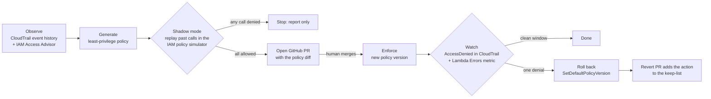

# IAM Least-Privilege Autopilot

[](https://github.com/singha105/iam-autopilot/actions/workflows/ci.yml)


[](LICENSE)

Most IAM policies grant far more than the workload uses: `s3:*` where the app only lists
buckets, `dynamodb:*` where it reads one table. Shrinking them by hand is slow, and it's
risky because nobody knows which rare code path needs which permission.

The autopilot shrinks a policy the way a careful engineer would. It looks at what the role
really did, proposes a smaller policy as a pull request, applies it only after a human
merges that PR, then watches for breakage and **rolls back by itself within seconds** if
anything gets denied.

It is written in Go, orchestrated by AWS Step Functions, and built to cost **$0**: it uses
only features that are free outright or sit far inside AWS's always-free allowances.

> **Status: Day 5 of 6 done.** The whole loop runs in AWS: a Step Functions rollout observed
> the inventory role, opened a PR, waited for the merge, applied the tightened policy as a new
> version, watched it for 45 minutes and finished `ENFORCED` (1273 → 5 actions). The
> automatic-rollback demo (a quarter-end job the observation never saw) is Day 6.
> See [PROGRESS.md](PROGRESS.md) for the live checklist.

## How a rollout works

One rollout tightens one role's policy:



1. **Observe.** CloudTrail event history lists every management API call the role made
   in the last 90 days, with parameters, so resources can be scoped to exact ARNs. IAM
   Access Advisor lists which services the role touched at all, including data-plane calls.
2. **Generate.** Build the smallest policy that covers the observed calls. Output is
   deterministic (sorted actions, statements and keys), so PR diffs are clean.
3. **Shadow.** Replay every observed call through the IAM policy simulator. If any call
   would be denied, stop and report instead of proposing.
4. **Propose.** Open a pull request that changes `policies/demo/<app>.json`. The merge is
   the approval: every change has a reviewer, a diff and a record in Git.
5. **Enforce.** GitHub Actions calls a small approver Lambda through OIDC (no AWS keys in
   GitHub), which creates a new version of the customer-managed policy.
6. **Watch.** For the watch window, poll two signals. The Lambda `Errors` metric shows up
   within about a minute; CloudTrail `AccessDenied` events confirm *which* action was denied.
7. **Roll back.** One denial triggers `SetDefaultPolicyVersion` back to the previous version,
   which takes seconds. A revert PR adds the denied action to that role's keep-list, so the
   system learns rare actions such as a job that only runs at quarter end.

### The data-plane blind spot, handled on purpose

CloudTrail event history never records data-plane calls such as DynamoDB `GetItem` or S3
`GetObject`; only a paid trail with data events does. Rather than pay for one, the
generator keeps a service's data-plane actions when Access Advisor shows that service was
used, scopes them to resources it did see, and flags them in the PR for a human to review.
The list of those actions lives in [`autopilot.yaml`](autopilot.yaml).

This is real, not theoretical. After the Day 1 traffic runs, event history for
`iamap-demo-config-reader` shows its `DescribeTable` and `GetParameter` calls, but no
`GetItem` or `PutItem`, even though every run wrote its DynamoDB item.

## Safety model

The autopilot is built to run in an account that already holds other work.

- **Narrow blast radius.** It only ever modifies customer-managed policies under the IAM
  path `/iamap/managed/` that are attached to roles tagged `autopilot:managed=true`. It
  refuses everything else, including its own roles and any AWS-managed policy.
- **One policy per role, changed through versions.** Rollback is a single API call.
- **Permissions boundary on the demo roles.** The demo policies are deliberately far too
  broad (`ec2:*`, `s3:*`, `ssm:*` …), because that is the point of the demo. The
  `iamap-demo-boundary` boundary caps what those roles can *actually* do: read-style calls,
  SSM parameters under `/iamap/demo/*`, and one DynamoDB table. However broad the policy
  looks, a demo role can't touch other buckets, roles or data.
- **No stored credentials.** Local work uses a short-lived `aws login` session. CI has no
  AWS credentials at all. The GitHub token for opening PRs is stored by hand in SSM
  Parameter Store (Day 4), never in Terraform or Git.
- **Humans approve every change.** Nothing is applied without a merged PR, and Terraform
  changes go through a saved, reviewed plan (`make plan` then `make apply`).

## Zero-cost design

| Uses (free) | Why it costs $0 |
|---|---|
| CloudTrail event history (`LookupEvents`) | Always on, 90 days, free; no trail is created |
| IAM Access Advisor, policy simulator, Access Analyzer `ValidatePolicy` | Free IAM features |
| Lambda (Go, arm64, 128–256 MB, no VPC) | Far inside the always-free 1M requests a month |
| Step Functions **Standard** | About 30 state transitions per rollout, inside 4,000 free a month |
| DynamoDB **provisioned** 1 RCU / 1 WCU | Inside the always-free 25 units |
| SSM Parameter Store, standard tier, default `aws/ssm` key | Free |
| CloudWatch `GetMetricStatistics`, built-in Lambda metrics, 3-day log retention | Inside the free allowances |
| IAM roles and policies, GitHub OIDC provider, AWS Budgets | Free |
| GitHub Actions | Free on a public repo |

Deliberately **not** used: CloudTrail trails, CloudTrail Lake and data events; Athena; Glue;
Access Analyzer analyzers and custom policy checks; the Cost Explorer API; Secrets
Manager; customer-managed KMS keys; EC2, EKS, ECS, NAT gateways, load balancers, API
Gateway and VPC-attached Lambdas; DynamoDB on-demand; Step Functions Express; CloudWatch
alarms, dashboards and `GetMetricData`; X-Ray; an S3 bucket for Terraform state (state
stays local and gitignored). The full rules are in [CLAUDE.md](CLAUDE.md).

Two guardrails enforce this:

- a `$0.01` monthly budget (`iamap-zero-spend`) that emails on the first cent of actual spend;
- `make cost-audit`, a read-only script that fails if any resource tagged
  `Project=iam-autopilot` is of a forbidden type, if a CloudTrail trail belongs to the
  project, or if a table, parameter, Lambda, log group or state machine breaks the rules.

## The demo workloads

Three small Go Lambdas give the autopilot something real to tighten. Each one returns every
AWS error as the Lambda error, so it shows in the `Errors` metric, and logs it as one JSON line.

| Function | What it calls | Over-broad policy it starts with |
|---|---|---|
| `iamap-demo-inventory` | `ec2:DescribeRegions`, `ec2:DescribeInstances`, `s3:ListBuckets`, `lambda:ListFunctions`, `iam:ListRoles` | `ec2:*`, `s3:*`, `lambda:*`, `iam:Get*`, `iam:List*`, `sqs:*`, `sns:*` |
| `iamap-demo-config-reader` | `ssm:GetParameter`, `dynamodb:DescribeTable`, then `GetItem` and `PutItem` (data-plane, invisible to event history) | `ssm:*`, `dynamodb:*`, `sqs:*`, `sns:*`, `kms:Decrypt` |
| `iamap-demo-quarterly` | `ssm:GetParameter`; with `{"mode":"quarter-end"}` it also calls `ssm:GetParametersByPath` | `ssm:*`, `ec2:Describe*`, `logs:*`, `sns:*` |

The quarterly app's rare path is the rollback demo. The traffic script never sends
`quarter-end`, so the autopilot never sees `GetParametersByPath` and removes it. Triggering
quarter-end afterwards causes a real `AccessDenied` and an automatic rollback.

## Getting started

### Prerequisites

AWS CLI v2, Terraform 1.6+, Go 1.25+, `make`, `jq`, and an AWS account you can log in to
with a short-lived session.

### Deploy the foundation

```bash
aws login --profile <your-profile>
export AWS_PROFILE=<your-profile> AWS_REGION=us-east-1

cp infra/terraform/terraform.tfvars.example infra/terraform/terraform.tfvars
# edit budget_email in terraform.tfvars (gitignored)

make check        # vet, gofmt, race tests, terraform fmt + validate (no AWS calls)
make plan         # build the arm64 Lambdas, write infra/terraform/tfplan
make apply        # apply exactly that reviewed plan, nothing else
make traffic      # invoke each demo Lambda 5 times; prints OK/ERROR per call
make cost-audit   # read-only check that nothing billable exists
```

CloudTrail event history takes a few minutes to show calls (up to about 15), and Access
Advisor data can lag by up to 4 hours, so run `make traffic` a few times before observing.

Check that the demo calls were recorded:

```bash
aws cloudtrail lookup-events \
  --lookup-attributes AttributeKey=Username,AttributeValue=iamap-demo-inventory \
  --max-results 5
```

### Observe a role

```bash
go run ./cmd/autopilot observe --role iamap-demo-config-reader-role --days 7
```

It reads CloudTrail event history and IAM Access Advisor (read-only), writes the usage
profile to `build/profiles/<role>.json` and prints a summary like this one from a real run
(account ID shown as the fixture placeholder):

```
Observed actions (2), from CloudTrail event history:
  dynamodb:DescribeTable  arn:aws:dynamodb:us-east-1:123456789012:table/iamap-demo-config  x25  read  ...
  ssm:GetParameter        arn:aws:ssm:us-east-1:123456789012:parameter/iamap/demo/config   x25  read  ...

Services accessed (4 of 6 granted), from IAM Access Advisor:
  dynamodb  last 2026-09-29T18:18:08Z  tracked: dynamodb:DescribeTable
  ...
  not used in window: sns, sqs

Warnings (2):
  - excluded 2 platform call(s): kms:Decrypt by the Lambda runtime (environment variable decryption) ...
```

The app reads and writes a DynamoDB item on every run, but `GetItem`/`PutItem` never
appear: that is the data-plane blind spot, and Access Advisor showing `dynamodb` as used
is what lets Day 3 keep those actions safely.

The observer refuses any role not tagged `autopilot:managed=true`, keeps only events whose
session issuer is the role itself, paces `LookupEvents` at 1.5 requests/second with
throttling retries, and drops calls AWS made with the role's credentials rather than the
function's code ([ADR-002](DECISIONS.md#adr-002-exclude-platform-calls-from-observed-usage)).
`--record <dir>` saves every raw API response as a redacted test fixture.

### Generate a proposal and prove it in shadow mode

```bash
go run ./cmd/autopilot generate --role iamap-demo-config-reader-role --profile build/profiles/iamap-demo-config-reader-role.json
go run ./cmd/autopilot shadow   --role iamap-demo-config-reader-role --policy out/iamap-demo-config-reader-role/proposed-policy.json \
                                --profile build/profiles/iamap-demo-config-reader-role.json
```

`generate` reads the role's one policy under `/iamap/managed/`, applies rules R1–R7 against
the usage profile and the embedded IAM action catalog (`make catalog` refreshes it from AWS's
Service Authorization Reference), validates the result with Access Analyzer `ValidatePolicy`,
and writes `out/<role>/proposed-policy.json`, `summary.json` and `summary.md`. `shadow` replays
every past call through the IAM policy simulator and exits 1 if any would be denied. Both are
read-only and free. Real results from Day 3:

| Role | Granted before → after | Removed | Shadow |
|---|---|---|---|
| inventory | 1273 → 5 | 99.6% | 5/5 allowed |
| config-reader | 305 → 4 | 98.7% | 2/2 allowed |
| quarterly | 532 → 1 | 99.8% | 1/1 allowed |

The rules: **R1** remove unused services · **R2** keep observed actions on their resources ·
**R3** keep Access Advisor tracked actions · **R4** keep data-plane actions only with evidence,
marked kept-unobservable ([ADR-003](DECISIONS.md#adr-003-keep-data-plane-actions-only-with-evidence-rule-r4)) ·
**R5** scope only to ARNs the action supports · **R6** keep-lists from `autopilot.yaml` ·
**R7** never grant more than the current policy. Why the simulator rather than Access Analyzer's
paid custom checks: [ADR-004](DECISIONS.md#adr-004-iam-policy-simulator-for-shadow-mode-not-access-analyzer-custom-checks).

### Propose a change as a pull request

```bash
go run ./cmd/autopilot propose --role iamap-demo-inventory-role --dry-run   # prints the PR, writes nothing
go run ./cmd/autopilot propose --role iamap-demo-inventory-role             # records the rollout, opens the PR
go run ./cmd/autopilot status                                               # lists rollouts
go run ./cmd/autopilot cancel  --rollout <rolloutId>                        # closes the PR unmerged
```

`propose` chains observe → generate → validate → shadow, then records the outcome in the
`iamap-rollouts` DynamoDB table:

- `SHADOW_FAILED` if any past call would be denied;
- `NOTHING_TO_DO` if the proposal grants exactly what the current policy grants;
- `PR_OPEN` otherwise, after which it opens a labelled PR that edits the role's policy file.

[PR #1](https://github.com/singha105/iam-autopilot/pull/1) is the real one from Day 4,
closed unmerged because enforcement is not built yet. A merge is the approval
([ADR-005](DECISIONS.md#adr-005-a-merged-pr-is-the-approval-the-github-token-lives-in-ssm-securestring)).
The GitHub token comes from `GITHUB_TOKEN` or the SSM SecureString `/iamap/github/token`, which
you create yourself:

```bash
read -rs "GH_TOKEN?GitHub token: " && aws ssm put-parameter --name /iamap/github/token --type SecureString --tier Standard --value "$GH_TOKEN"; unset GH_TOKEN
```

Status changes are conditional writes, so two processes can never both move one rollout.

### Run a full rollout in AWS

```bash
make rollout ROLE=iamap-demo-inventory-role   # starts the iamap-rollout state machine
make status                                    # autopilot report --short
```

The STANDARD Step Functions workflow `iamap-rollout` calls one Go Lambda
(`iamap-worker`) for every step:

- **observe → generate → shadow → open the PR.** If shadow mode finds a would-be denial
  the rollout stops at `ShadowFailed`; if nothing would change it ends at `NothingToDo`.
- **Wait for approval.** The execution waits on a task token for up to 7 days.
- **Merge the PR.** The `approve-rollout` workflow assumes `iamap-github-approver` through
  OIDC ([ADR-007](DECISIONS.md#adr-007-github-actions-approves-through-oidc-scoped-to-this-repos-pull_request-events))
  and calls `iamap-approver`. The approver re-checks the merge with GitHub and resumes
  the execution.
- **Enforce.** The new policy becomes a new default *version*, and the previous version
  is kept as the rollback target
  ([ADR-006](DECISIONS.md#adr-006-one-managed-policy-per-role-changed-through-policy-versions)).
- **Watch.** Every 5 minutes for 30 + 15 minutes, check CloudTrail for AccessDenied and
  the Lambda `Errors` metric
  ([ADR-008](DECISIONS.md#adr-008-two-breakage-signals-cloudtrail-accessdenied-and-the-lambda-errors-metric)).
- **End.** `Done`, with the record ENFORCED and a final PR comment. Or, on any breakage,
  `Rollback` restores the previous version, comments, and opens a revert PR that adds
  the denied action to `keepActions`.

A normal rollout is **35 state transitions** (6 + 3 per watch iteration × 9 + Complete +
Done). The free tier is 4,000 transitions a month, so about 114 rollouts. The workflow
logs nothing to CloudWatch.

**The first real rollout (Day 5, inventory role)** ran end to end: proposal
[PR #2](https://github.com/singha105/iam-autopilot/pull/2) merged, approved through OIDC,
policy version `v1` → `v2` (1273 → 5 actions, 99.6% removed), 9 clean watch iterations
with traffic running, `Done` after 35 transitions, record `ENFORCED`, and `terraform plan`
clean afterwards because `main` holds the same JSON as the live version.

### Tear down

```bash
make destroy      # interactive terraform destroy
```

### Make targets

| Target | What it does |
|---|---|
| `build` | Builds every `cmd/*` for linux/arm64 into `build/<name>/bootstrap` (`CGO_ENABLED=0`, `-tags lambda.norpc`) |
| `test` | `go test ./... -race` |
| `lint` | `go vet` and a `gofmt` check |
| `tf-fmt` / `tf-validate` | `terraform fmt -check`, then `init -backend=false` and `validate` |
| `check` | `lint` + `test` + `tf-fmt` + `tf-validate` |
| `plan` / `apply` | Build, then plan to `tfplan`; apply only that saved plan |
| `traffic` / `cost-audit` | Run `scripts/traffic.sh` / `scripts/cost-audit.sh` |
| `rollout ROLE=<name>` | Start a rollout execution; prints the execution ARN and console link |
| `status` | `autopilot report --short`: every rollout with status, PR and removed % |
| `destroy` | Interactive `terraform destroy` |

## Repository layout

```
cmd/autopilot/            CLI: observe, generate, shadow, propose, cancel, status
cmd/worker/               one Lambda binary; MODE=worker or MODE=approver
cmd/demo-*/               the three demo Lambdas                           (Day 1)
internal/observe/         CloudTrail event history + Access Advisor -> usage profile
internal/catalog/         embedded IAM action catalog (make catalog), wildcard expansion
internal/generate/        least-privilege policy + summary
internal/shadow/          policy simulator replay
internal/githubpr/        branch, commit, PR, comments
internal/store/           DynamoDB rollout records with conditional status moves
internal/rollout/         BuildPlan, enforce, watch, rollback, complete, approve
policies/demo/            the managed policy JSON that Terraform reads and PRs edit
statemachine/             Step Functions definition (rollout.asl.json) + structure tests
infra/terraform/          all AWS resources; local state, gitignored
scripts/                  traffic.sh, cost-audit.sh
testdata/observe/         recorded API responses per demo role (redacted) + golden profiles
testdata/generate/        recorded current policies (redacted) + golden proposals and summaries
internal/policy/          deterministic IAM policy documents (sorted keys)
internal/config/          autopilot.yaml loader (strict)
autopilot.yaml            roles, keep-lists, data-plane actions, watch window
CLAUDE.md                 hard zero-cost and safety rules
PROGRESS.md               day-by-day checklist and findings
DECISIONS.md              architecture decision records
```

## Engineering notes

- **Testing.** Code is unit-tested behind small interfaces with fakes and recorded fixtures;
  tests never call AWS (`go test ./...` passes with credentials unset). The observer has a
  golden-file tests: real API responses recorded from the demo roles (`testdata/observe/` and
  `testdata/generate/`, account ID redacted to `123456789012`) are replayed and the profile,
  proposed policy and summary must match their `expected-*.json` byte for byte (`-update`
  regenerates them). Further tests pin each day's acceptance criteria to that recorded data.
- **CI.** GitHub Actions runs lint, race tests and the arm64 build on Go 1.25, then
  `terraform fmt`, `init -backend=false` and `validate`, with pinned action SHAs and no
  AWS credentials.
- **Findings from the first deploy** (details in [PROGRESS.md](PROGRESS.md)):
  - The Lambda service itself makes calls under the function's role session (`kms:Decrypt`
    with `invokedBy: lambda.amazonaws.com`). The observer filters these out, or the
    tightened policy would keep permissions the app never uses.
  - Event names are not always IAM action names: Lambda's `ListFunctions` is recorded as
    `ListFunctions20150331`, so the observer maps event names to IAM actions.
  - The Lambda runtime also calls AWS with the role's credentials at cold start
    (`CreateLogStream`, env-var `kms:Decrypt`) *without* `invokedBy`; the observer
    recognises those too.
- **Decisions.** The reasoning behind each design choice is recorded in [DECISIONS.md](DECISIONS.md).

## License

[MIT](LICENSE) © 2026 Arnab Singh
